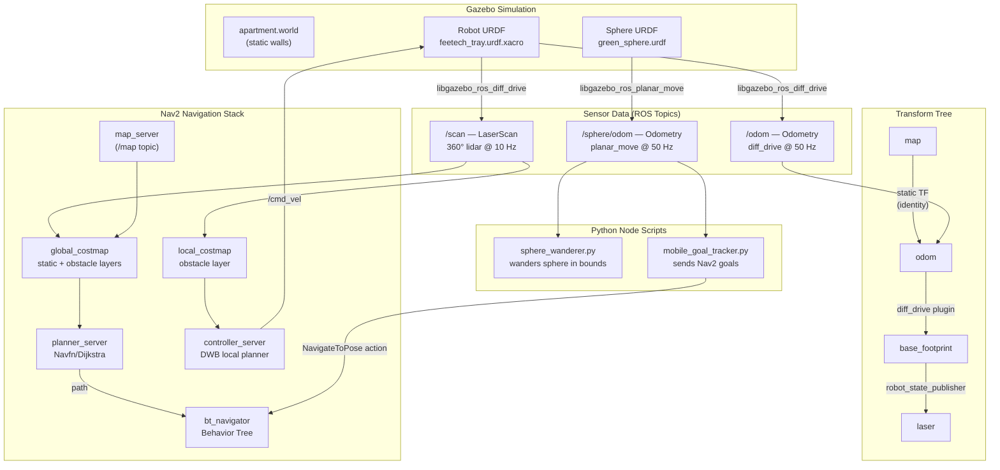

# Candle – Autonomous Mobile Robot: Technical Walkthrough

*ROS 2 Humble · Gazebo Classic · Nav2 · Python 3*

---

## 1. System Overview

Candle is a **differential-drive service robot** that autonomously navigates an apartment-style environment using a 2D lidar sensor and the ROS 2 Navigation Stack (Nav2). A movable green sphere acts as a dynamic goal. The robot continuously computes Dijkstra-based paths to the sphere's current position, replanning on every significant sphere movement.



---

## 2. File Layout

```
colcon_ws/src/
├── urdf_tutorial/
│   ├── launch/
│   │   └── gazebo.launch.py          ← Terminal 1: starts simulation
│   ├── urdf/
│   │   └── feetech_tray.urdf.xacro   ← Robot body, wheels, lidar, plugins
│   └── world/
│       └── apartment.world           ← Gazebo 3-D wall geometry
│
└── main_run/
    ├── launch/
    │   └── navigation.launch.py      ← Terminal 2: Nav2 + RViz
    ├── config/
    │   └── nav2_params.yaml          ← All Nav2 tuning parameters
    ├── maps/
    │   ├── empty_world.pgm           ← 2D occupancy grid (auto-generated)
    │   └── map.yaml                  ← Map metadata (resolution, origin)
    ├── scripts/
    │   ├── sphere_wanderer.py        ← Terminal 3: moves the sphere
    │   └── mobile_goal_tracker.py   ← Terminal 4: robot chases sphere
    └── urdf/
        └── green_sphere.urdf         ← Mobile goal visual + physics
```

Also at project root:  
[gen_apartment.py](file:///c:/Users/User/Downloads/Candle_TheRobot-main/gen_apartment.py) — regenerates **both** `apartment.world` and `empty_world.pgm` from the same wall definitions so they are always in sync.

---

## 3. How to Start the Project

Run each command in a **separate WSL terminal** inside the `colcon_ws` directory:

```bash
# ── Terminal 1: Simulation ──────────────────────────────────────
killall -9 gzserver gzclient rviz2 2>/dev/null
export MESA_D3D12_DEFAULT_ADAPTER_NAME=NVIDIA
export MESA_GL_VERSION_OVERRIDE=3.3
ros2 launch urdf_tutorial gazebo.launch.py

# ── Terminal 2: Navigation (wait ~15 s for Gazebo to settle) ───
source install/setup.bash
ros2 launch main_run navigation.launch.py

# ── Terminal 3: Sphere wanderer ─────────────────────────────────
source install/setup.bash
ros2 run main_run sphere_wanderer.py
# Press 's' to toggle stop/resume, Ctrl-C to quit

# ── Terminal 4: Robot tracker ───────────────────────────────────
source install/setup.bash
ros2 run main_run mobile_goal_tracker.py
```

> **Manual goal mode**: skip Terminals 3 & 4, open RViz from Terminal 2 and click **Nav2 Goal** (green arrow) anywhere on the map.

---

## 4. File Deep-Dives

---

### 4.1 [feetech_tray.urdf.xacro](file:///c:/Users/User/Downloads/Candle_TheRobot-main/colcon_ws/src/urdf_tutorial/urdf/feetech_tray.urdf.xacro) — Robot Description

This XACRO file describes every physical and simulated component of the Candle robot.

#### 4.1.1 Differential Drive Plugin — activates `/cmd_vel` and `/odom`

```xml
<gazebo>
  <plugin name="diff_drive" filename="libgazebo_ros_diff_drive.so">
    <ros>
      <remapping>cmd_vel:=/cmd_vel</remapping>   <!-- receives velocity commands -->
      <remapping>odom:=/odom</remapping>          <!-- publishes wheel odometry  -->
    </ros>
    <left_joint>left_wheel_joint</left_joint>
    <right_joint>right_wheel_joint</right_joint>
    <wheel_separation>0.267</wheel_separation>   <!-- axle width in metres -->
    <wheel_diameter>0.066</wheel_diameter>
    <publish_odom>true</publish_odom>             <!-- enables /odom topic -->
    <publish_odom_tf>true</publish_odom_tf>       <!-- broadcasts odom→base_footprint TF -->
    <robot_base_frame>base_footprint</robot_base_frame>
  </plugin>
</gazebo>
```

`libgazebo_ros_diff_drive.so` bridges Gazebo's physics engine to ROS 2:
- **Input**: `/cmd_vel` (`geometry_msgs/Twist`) — velocity commands from the Nav2 controller
- **Output**: `/odom` (`nav_msgs/Odometry`) — dead-reckoning position; also broadcasts the `odom → base_footprint` TF frame

#### 4.1.2 Lidar Sensor — activates `/scan`

```xml
<gazebo reference="laser">
  <sensor type="ray" name="rplidar_sensor">
    <update_rate>10</update_rate>
    <ray>
      <scan>
        <horizontal>
          <samples>360</samples>               <!-- one ray per degree -->
          <min_angle>-3.14159</min_angle>      <!-- full 360° sweep    -->
          <max_angle>3.14159</max_angle>
        </horizontal>
      </scan>
      <range>
        <min>0.15</min>                        <!-- 15 cm blind spot   -->
        <max>10.0</max>                        <!-- 10 m range         -->
      </range>
      <noise><type>gaussian</type><stddev>0.01</stddev></noise>
    </ray>
    <plugin filename="libgazebo_ros_ray_sensor.so">
      <ros>
        <remapping>~/out:=/scan</remapping>    <!-- publishes to global /scan -->
      </ros>
      <output_type>sensor_msgs/LaserScan</output_type>
      <frame_name>laser</frame_name>
    </plugin>
  </sensor>
</gazebo>
```

The `laser` link is mounted **11 cm above `base_link`** via a fixed joint. At 10 Hz it emits 360 range measurements published to `/scan` — the primary input to both Nav2 costmaps and the obstacle layer.

---

### 4.2 [green_sphere.urdf](file:///c:/Users/User/Downloads/Candle_TheRobot-main/colcon_ws/src/main_run/urdf/green_sphere.urdf) — Mobile Goal Object

```xml
<plugin name="object_controller" filename="libgazebo_ros_planar_move.so">
  <ros>
    <namespace>/sphere</namespace>          <!-- isolates topics to /sphere/* -->
    <remapping>cmd_vel:=cmd_vel</remapping> <!-- listens: /sphere/cmd_vel     -->
    <remapping>odom:=odom</remapping>       <!-- publishes: /sphere/odom      -->
  </ros>
  <publish_odom>true</publish_odom>
  <publish_odom_tf>false</publish_odom_tf> <!-- does NOT pollute TF tree      -->
</plugin>
```

`libgazebo_ros_planar_move.so` lets us move the sphere **kinematically** (ignoring collision physics), so it can pass through walls. The `/sphere` namespace ensures its topics never collide with the robot's `/cmd_vel` and `/odom`.

---

### 4.3 [gazebo.launch.py](file:///c:/Users/User/Downloads/Candle_TheRobot-main/colcon_ws/src/urdf_tutorial/launch/gazebo.launch.py) — Simulation Launcher

| Action | What it does |
|---|---|
| `SetEnvironmentVariable('GAZEBO_MODEL_PATH', …)` | Allows Gazebo to resolve `package://` mesh URIs |
| `robot_state_publisher` | Reads the XACRO, publishes TF for all static robot joints (`base_link → laser`, etc.) |
| `gzserver` with `apartment.world` | Starts physics simulation with the apartment wall geometry |
| `gzclient` | Opens the 3D Gazebo GUI window |
| `spawn_entity.py` (robot) | Drops the robot at [(0, 0, 0)](file:///c:/Users/User/Downloads/Candle_TheRobot-main/colcon_ws/src/main_run/scripts/main.py#16-20) |
| `spawn_entity.py` (sphere) | Drops the sphere at [(2.0, 0.0, 0.2)](file:///c:/Users/User/Downloads/Candle_TheRobot-main/colcon_ws/src/main_run/scripts/main.py#16-20) with namespace `/sphere` |

---

### 4.4 [navigation.launch.py](file:///c:/Users/User/Downloads/Candle_TheRobot-main/colcon_ws/src/main_run/launch/navigation.launch.py) — Nav2 + RViz Launcher

Three things launch **immediately** (no timer):

```python
# 1. map→odom identity transform — provides the TF Nav2 costmaps require
static_map_odom_tf = Node(
    package='tf2_ros', executable='static_transform_publisher',
    arguments=['0', '0', '0', '0', '0', '0', 'map', 'odom']
)

# 2. Standalone map_server — publishes the 2D occupancy grid to /map
map_server_node = Node(
    package='nav2_map_server', executable='map_server',
    parameters=[{'yaml_filename': map_yaml_file}]
)

# 3. Lifecycle manager auto-activates map_server
map_lifecycle_manager = Node(
    package='nav2_lifecycle_manager', executable='lifecycle_manager',
    parameters=[{'autostart': True, 'node_names': ['map_server']}]
)
```

After a 10-second delay (Gazebo startup), the full Nav2 navigation stack plus RViz are launched via `navigation_launch.py`.

> **Why separate from AMCL?** AMCL (particle-filter localisation) was found to silently crash inside the Nav2 component container due to YAML parameter type conflicts in ROS 2 Humble. Since the robot's start pose is known (always [(0,0)](file:///c:/Users/User/Downloads/Candle_TheRobot-main/colcon_ws/src/main_run/scripts/main.py#16-20) in Gazebo), a **static identity transform** `map → odom` is used instead, giving equivalent accuracy for a simulation context.

---

### 4.5 [nav2_params.yaml](file:///c:/Users/User/Downloads/Candle_TheRobot-main/colcon_ws/src/main_run/config/nav2_params.yaml) — Navigation Tuning

#### Global Costmap (used by Dijkstra's planner)
```yaml
global_costmap:
  global_costmap:
    ros__parameters:
      global_frame: map
      robot_base_frame: base_footprint
      plugins: ["static_layer", "obstacle_layer", "inflation_layer"]
      static_layer:
        map_subscribe_transient_local: True   # receives map from map_server
      obstacle_layer:
        scan:
          topic: /scan                        # populated by lidar
      inflation_layer:
        inflation_radius: 0.55               # safety bubble around walls
```

#### Local Costmap (used by DWB controller for real-time obstacle avoidance)
```yaml
local_costmap:
  local_costmap:
    ros__parameters:
      global_frame: odom
      rolling_window: true          # 3x3 m window that follows the robot
      plugins: ["voxel_layer", "inflation_layer"]
      voxel_layer:
        scan:
          topic: /scan              # live lidar feed for reactive avoidance
```

#### Planner — Dijkstra (Navfn)
```yaml
planner_server:
  ros__parameters:
    planner_plugins: ["GridBased"]
    GridBased:
      plugin: "nav2_navfn_planner/NavfnPlanner"
      use_astar: false              # false = Dijkstra's algorithm
      tolerance: 0.5               # goal tolerance in metres
```

#### Controller — DWB (Dynamic Window Approach)
```yaml
controller_server:
  ros__parameters:
    controller_frequency: 20.0
    FollowPath:
      plugin: "dwb_core::DWBLocalPlanner"
      max_vel_x: 0.26              # max forward speed  (m/s)
      max_vel_theta: 1.0           # max rotation speed (rad/s)
      critics: ["RotateToGoal", "Oscillation", "BaseObstacle",
                "GoalAlign", "PathAlign", "PathDist", "GoalDist"]
```

---

### 4.6 `apartment.world` and [gen_apartment.py](file:///c:/Users/User/Downloads/Candle_TheRobot-main/gen_apartment.py) — Environment

The world is a **12 m × 10 m apartment** (`x: −6..+6`, `y: −5..+5`) with:
- Outer boundary walls (4 walls)
- A central hallway at `y: −1..+1`
- Living room (left), Kitchen (bottom-left), Bedroom 1 + Bedroom 2 (right), Bathroom (top-right corner)
- Doorway gaps in all interior walls

[gen_apartment.py](file:///c:/Users/User/Downloads/Candle_TheRobot-main/gen_apartment.py) reads a Python list of wall tuples and writes **both** files from the same source of truth:

```python
walls = [
    # (name, cx, cy, yaw_deg, length, thickness, height)
    ("south",   0.0, -5.0,  0, 12.5,  0.25, 2.5),
    ("north",   0.0,  5.0,  0, 12.5,  0.25, 2.5),
    # ... interior walls with doorway gaps ...
]

# → apartment.world : each tuple becomes a <model> SDF box
# → empty_world.pgm : each tuple is drawn as black pixels
```

This guarantees the Gazebo collision geometry and the Nav2 map are always **identical**.

---

### 4.7 [sphere_wanderer.py](file:///c:/Users/User/Downloads/Candle_TheRobot-main/colcon_ws/src/main_run/scripts/sphere_wanderer.py) — Mobile Goal Driver

```python
class SphereWanderer(Node):
    def __init__(self):
        # Subscribe to /sphere/odom to know own position
        self._sub = self.create_subscription(Odometry, '/sphere/odom',
                                             self._odom_cb, 10)
        self._pub = self.create_publisher(Twist, '/sphere/cmd_vel', 10)

        # Pick a new random heading every 3 seconds
        self.create_timer(HEADING_HOLD, self._pick_heading)
        # Publish velocity at 10 Hz
        self.create_timer(0.1, self._step)
```

**Key logic — apartment boundary bounce:**
```python
def _wall_bounce_angle(self):
    """If near a boundary, return an inward-pointing angle."""
    margin = 1.2   # metres of look-ahead before bouncing
    if self._pos_x < X_MIN + margin:
        return random.uniform(-0.4*pi, 0.4*pi)  # point toward +X
    if self._pos_x > X_MAX - margin:
        return random.uniform(0.6*pi, 1.4*pi)   # point toward -X
    if self._pos_y < Y_MIN + margin:
        return random.uniform(0.1*pi, 0.9*pi)   # point toward +Y
    if self._pos_y > Y_MAX - margin:
        return random.uniform(-0.9*pi, -0.1*pi) # point toward -Y
    return None
```

**Velocity command — planar move (world-frame X/Y):**
```python
def _step(self):
    msg = Twist()
    vx = SPEED * math.cos(self._heading)   # world-frame X component
    vy = SPEED * math.sin(self._heading)   # world-frame Y component
    msg.linear.x = vx
    msg.linear.y = vy                      # libgazebo_ros_planar_move uses linear.y
    self._pub.publish(msg)
```

---

### 4.8 [mobile_goal_tracker.py](file:///c:/Users/User/Downloads/Candle_TheRobot-main/colcon_ws/src/main_run/scripts/mobile_goal_tracker.py) — Robot Goal Sender

```python
class MobileGoalTracker(Node):
    def __init__(self):
        # Nav2 action client — wraps the NavigateToPose action server
        self._action_client = ActionClient(self, NavigateToPose,
                                           'navigate_to_pose')
        # Listen to sphere position
        self.create_subscription(Odometry, '/sphere/odom',
                                 self.odom_callback, 10)
        self.goal_distance_threshold = 0.5  # only replan if sphere moved >0.5m
```

**Goal update logic:**
```python
def odom_callback(self, msg):
    target_x = msg.pose.pose.position.x
    target_y = msg.pose.pose.position.y

    # Throttle: skip if sphere hasn't moved far enough
    if self.last_goal_x is not None:
        dist = math.sqrt((target_x - self.last_goal_x)**2 +
                         (target_y - self.last_goal_y)**2)
        if dist < self.goal_distance_threshold:
            return   # no new goal needed

    self.send_goal(target_x, target_y)
```

**Goal dispatch — NavigateToPose action:**
```python
def send_goal(self, x, y):
    # Cancel any in-flight goal so Nav2 doesn't queue up stale goals
    if self._current_goal_handle is not None:
        self._current_goal_handle.cancel_goal_async()

    goal_msg = NavigateToPose.Goal()
    goal_msg.pose.header.frame_id = 'map'      # goal in map frame
    goal_msg.pose.pose.position.x = x
    goal_msg.pose.pose.position.y = y
    goal_msg.pose.pose.orientation.w = 1.0     # face forward

    self._action_client.send_goal_async(goal_msg,
        feedback_callback=self.feedback_callback)
```

---

## 5. Data Flow Summary

```
Gazebo physics           ROS 2 topics             Nav2 consumers
═══════════════          ════════════             ══════════════
lidar ray cast   ──────▶ /scan (LaserScan)  ──┬─▶ global_costmap (obstacle layer)
                                               └─▶ local_costmap  (voxel layer)

diff_drive sim   ──────▶ /odom (Odometry)   ──▶ odom→base_footprint TF
                 ──────▶ TF odom→base_fp
                                              
static TF pub    ──────▶ TF map→odom        ──▶ global/local costmap frames

map_server       ──────▶ /map               ──▶ global_costmap (static layer)

planner_server   ← global_costmap + goal ──▶ /plan (Path)
controller_srv   ← local_costmap + path  ──▶ /cmd_vel (Twist)

/cmd_vel         ──────▶ diff_drive plugin ──▶ wheel velocities in Gazebo

/sphere/odom  ─┬─▶ sphere_wanderer.py  (boundary check, heading update)
               └─▶ mobile_goal_tracker.py ─▶ NavigateToPose ─▶ bt_navigator
```

---

## 6. Key Design Decisions

| Decision | Rationale |
|---|---|
| Static `map → odom` instead of AMCL | AMCL silently crashed in the Nav2 component container in ROS 2 Humble due to YAML type conflicts. The robot always spawns at origin in Gazebo so an identity transform is accurate. |
| Separate `map_server` (not inside Nav2 component container) | Same crash isolation principle — standalone lifecycle manager is more robust in WSL environments. |
| `libgazebo_ros_planar_move` for sphere | Provides direct kinematic control (ignores collision), allowing the sphere to be scripted freely and publish accurate ground-truth odometry for the tracker. |
| Absolute topic names `/scan`, `/odom`, `/cmd_vel` | Prevents namespace contamination when multiple robots or the `/sphere` prefixed topics coexist in the same ROS graph. |
| [gen_apartment.py](file:///c:/Users/User/Downloads/Candle_TheRobot-main/gen_apartment.py) generating both world + map | Single source of truth — if a wall is moved in Python, both the Gazebo collision geometry and the Nav2 static layer update together. |
